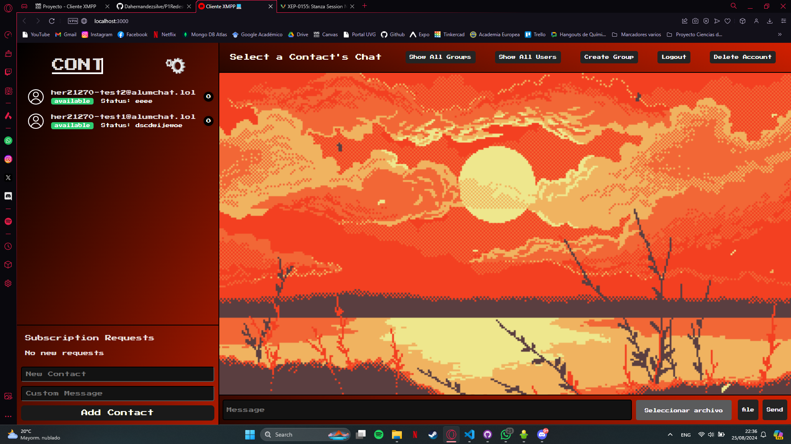

# 📱 XMPP Client Project


## 🚀 Project Overview
This project implements an instant messaging client that supports the XMPP protocol. The main objectives are:
- Implement a protocol based on the standards.
- Understand the purpose of the XMPP protocol.
- Comprehend how XMPP services work.
- Apply knowledge in Web and Mobile programming, alongside good development practices.

## 🛠 Features
The XMPP client supports the following functionalities:

**Account Management**
- Register a new account on the server.
- Log in with an existing account.
- Log out of an account.
- Delete an account from the server.

**Communication** 
- Display all users/contacts and their status.
- Add a user to the contact list.
- Show contact details of a user.
- One-to-one communication with any user/contact.
- Participate in group conversations.
- Set presence messages.
- Send/receive notifications.
- Send/receive files.

**XEPs**
Here there are some XEPs that are implemented directly or indirectly in the client:
- XEP-0199: XMPP Ping
- XEP-0045: Multi-User Chat
- XEP-0077: In-Band Registration
- XEP-0136: Message Archiving
- XEP-0138: Stream Compression
- XEP-0363: HTTP File Upload
- XEP-0079: Advanced Message Processing
- XEP-0030: Service Discovery

## 📋 Requirements

Before you begin, ensure you have the following installed:

-  Node.js (v16 or higher)
-  npm (Node Package Manager)
-  Yarn
-  Python 3.11.8


## ⚙️ Installation
Clone the repository to your local machine:

```bash
git clone https://github.com/Dahernandezsilve/P1RedesClienteXMPP.git
cd P1RedesClientXMPP
```

### Install backend dependencies:
Navigate to the backend directory and create a virtual environment:

```bash
python -m venv venv
source venv\Scripts\activate 
pip install -r requirements.txt
```

### Install frontend dependencies:
Navigate to the frontend directory and install npm dependencies:

```bash
cd frontend
yarn install
```

## 🚀 Usage
It is important to have two terminals running simultaneously: one for the frontend and another for the backend. 🚨

### Backend
Start the XMPP client backend:
Navigate to the backend directory and run:

```bash
python server.py
```

### Frontend
Run the frontend:
In the frontend directory, start the development server:

```bash
yarn dev
```

Automatically is going to open a website with the client, so you are ready to use it!.

### Account Management
- **Register a New Account:** Use the registration form to create a new XMPP account on the server.
- **Log in:** Enter your credentials to log in to your account.
- **Log out:** Simply click the logout button to disconnect.
- **Delete Account:** Permanently delete your account from the server through the settings menu.

### Communication
- **View Contacts:** All your contacts will be listed along with their status.
- **Add Contacts:** Use the search bar to add new users to your contact list.
- **View Contact Details:** Click on any contact to view more details.
- **1-to-1 Chat:** Start a conversation by selecting a contact.
- **Group Chat:** Join or create a group chat.
- **Set Presence:** Update your status with a custom message.
- **Notifications:** Receive real-time updates and alerts on contact's requests or new messages.
- **File Transfer:** Send and receive files directly through the chat interface.

## 💡 Features and Limitations

### 👁️ Features
- Cross-platform compatibility.
- Real-time messaging and notifications.
- Secure file transfer using XMPP protocol.

### 🚨 Limitations
- May require further testing on different XMPP servers because is configured specifically to alumchat.lol.
- The UI is optimized for modern browsers; older browsers may experience issues.It was tested on OperaGX.

## 👨‍💻 Development

### Structure
- **Frontend:** Developed using React, styled with CSS, and communicates with the backend via WebSocket.
- **Backend:** Built with Python, handling XMPP stanzas and providing APIs for the frontend with FastAPI.

### Tools and Libraries
- **React:** For building the user interface.
- **WebSocket:** For real-time communication between the frontend and backend.
- **SleekXMPP:** Python library for handling XMPP protocol in the backend.

## 🎯 Goals Achieved
- Implemented core XMPP functionalities with a modern web interface.
- Ensured real-time communication and presence updates.
- Achieved cross-platform compatibility and easy deployment.

## 📚 Learning Outcomes
- Gained a deep understanding of the XMPP protocol and its applications.
- Developed skills in real-time web application development using modern technologies.
- Enhanced knowledge in handling concurrent programming challenges.

## 🔧 Troubleshooting
- Ensure that the XMPP server is up and running.
- Check your firewall settings if you're unable to connect to the XMPP server.
- Verify that your Node.js and Python versions meet the project requirements.

## 💻 Author
- Diego Alexander Hernández Silvestre | Carne 21270 🛻

You are welcome to clone and contribute this repository 😁🪐🪁